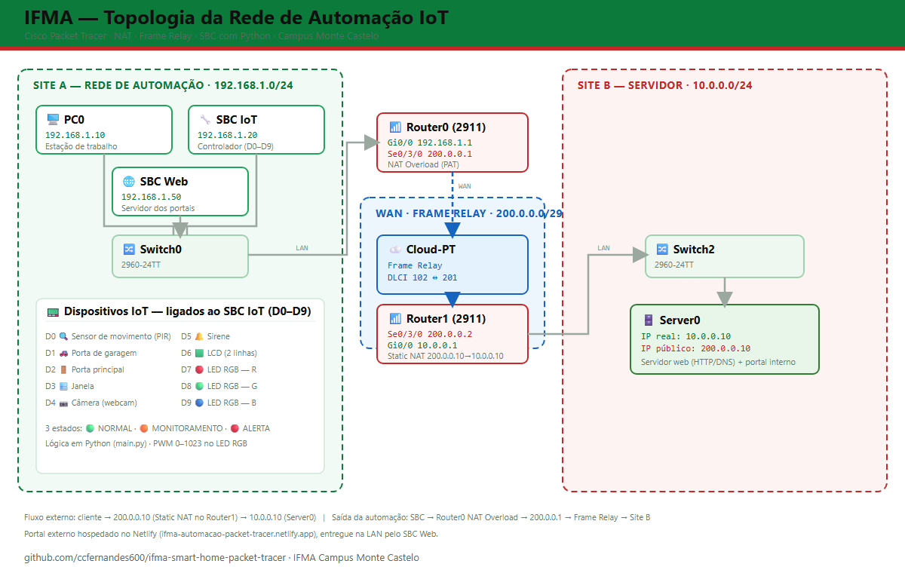

# Projeto IFMA – Automação Residencial no Cisco Packet Tracer

Simulação de automação residencial com IoT, NAT, Frame Relay e SBC no Cisco Packet Tracer.  
Sensores, LED RGB, LCD e lógica de segurança em 3 estados: **NORMAL**, **MONITORAMENTO** e **ALERTA**.

---

## 1. Objetivos do Projeto

- Simular uma **infraestrutura de rede corporativa** com acesso externo via NAT e Frame Relay.
- Integrar um **servidor de serviços** (DNS, Web, ICMP, Email) acessível com IP público.
- Implementar um **sistema de automação residencial** com sensores (movimento, porta, janela, garagem) e atuadores (câmera, sirene, LED RGB, LCD).
- Aplicar uma **lógica de segurança em três estados** com feedback visual e textual em tempo real.
- Publicar o resultado em servidor web local e em portal hospedado na nuvem (Netlify).

---

## 2. Topologia de Rede



### LAN – 192.168.1.0/24

| Dispositivo      | IP             | Função                                      |
|------------------|----------------|---------------------------------------------|
| PC0              | 192.168.1.10   | Estação de trabalho                         |
| SBC IoT          | 192.168.1.20   | Controlador dos dispositivos IoT (Python 3) |
| SBC Web          | 192.168.1.50   | Servidor dos portais web (proxy HTTP)       |
| Router0 (Gi0/0)  | 192.168.1.1/24 | Gateway da LAN                              |

### WAN – Frame Relay via Cloud-PT

| Dispositivo        | IP WAN       | Função                         |
|--------------------|--------------|--------------------------------|
| Router0 (Se0/3/0)  | 200.0.0.1/29 | Lado automação do backbone WAN |
| Router1 (Se0/3/0)  | 200.0.0.2/29 | Lado servidor do backbone WAN  |

### DMZ / Servidor – 10.0.0.0/24

| Dispositivo        | IP           | Função                                          |
|--------------------|--------------|--------------------------------------------------|
| Router1 (Gi0/0)    | 10.0.0.1/24  | Gateway da rede do servidor                     |
| Server0            | 10.0.0.10/24 | Servidor web (DNS, HTTP, Email, ICMP)           |
| IP Público NAT 1:1 | 200.0.0.10   | Acesso externo ao Server0 via Static NAT        |

---

## 3. Núcleo IoT – SBC IoT (192.168.1.20)

O microcontrolador inicial (MCU) foi substituído pelo **SBC IoT** devido a um bug crítico no Cisco Packet Tracer 9.0.0: as portas analógicas da MCU simplesmente não respondiam, mesmo com código correto. Ao migrar para o SBC com portas digitais, todas as funcionalidades passaram a operar imediatamente.

### 3.1 Mapa de Portas do SBC IoT

**Entradas – Sensores (D0–D3)**

| Porta | Dispositivo           | API utilizada                  |
|-------|-----------------------|--------------------------------|
| D0    | Sensor de Movimento   | `digitalRead` / `digitalWrite` |
| D1    | Sensor de Garagem     | `customRead` / `customWrite`   |
| D2    | Sensor de Porta       | `customRead` / `customWrite`   |
| D3    | Sensor de Janela      | `customRead` / `customWrite`   |

**Saídas – Atuadores (D4–D6)**

| Porta | Dispositivo           | API utilizada                |
|-------|-----------------------|------------------------------|
| D4    | Câmera                | `customRead` / `customWrite` |
| D5    | Sirene                | `customRead` / `customWrite` |
| D6    | Painel LCD (2 linhas) | `customRead` / `customWrite` |

**Saídas – LED RGB Digital com PWM (D7–D9)**

| Porta | Canal LED RGB    | API utilizada   |
|-------|------------------|-----------------|
| D7    | LED R (vermelho) | `analogWrite`   |
| D8    | LED G (verde)    | `analogWrite`   |
| D9    | LED B (azul)     | `analogWrite`   |

> **Observação:** O LED RGB utiliza `analogWrite` em portas **digitais** do SBC, que suportam PWM internamente.  
> A escala é **0–1023** (10 bits / 1024 níveis). Equivalência com a escala 8 bits (0–255): `valor_1023 = valor_255 × 4`.  
> Exemplo: 1023 = brilho máximo (≈ 255), 512 = meia intensidade (≈ 128), 0 = apagado.

---

## 4. Lógica de Segurança e Automação

Toda a lógica está implementada no arquivo `main.py` rodando no **SBC IoT**.

### 4.1 Presets de Cor do LED RGB

| Estado        | Cor     | R    | G   | B |
|---------------|---------|------|-----|---|
| NORMAL        | Verde   | 0    | 900 | 0 |
| MONITORAMENTO | Laranja | 1023 | 512 | 0 |
| ALERTA        | Vermelho| 1023 | 0   | 0 |

### 4.2 Estados de Operação

| Estado        | Condição                          | Câmera | Sirene | LED      | LCD (linha 1 / linha 2)                              |
|---------------|-----------------------------------|--------|--------|----------|------------------------------------------------------|
| NORMAL        | Sem movimento e sem abertura      | OFF    | OFF    | Verde    | `SISTEMA SEGURO` / `ESTADO NORMAL`                   |
| MONITORAMENTO | Movimento OU abertura (não ambos) | ON     | OFF    | Laranja  | `MONITORAMENTO` / `MOV. DETECTADO` ou `ABERTO: <setor>` |
| ALERTA        | Movimento E abertura simultâneos  | ON     | ON     | Vermelho | `ALERTA VIOLACAO` / `SETOR: <setor>`                 |

### 4.3 Funcionamento das Interrupções

O sistema utiliza `add_event_detect()` para resposta imediata a qualquer mudança nos sensores:

```python
add_event_detect(SENSOR_MOV, processar_sistema)
add_event_detect(GARAGEM,    processar_sistema)
add_event_detect(PORTA,      processar_sistema)
add_event_detect(JANELA,     processar_sistema)
```

Qualquer alteração em D0–D3 dispara automaticamente `processar_sistema()`, que reavalia todos os sensores e atualiza câmera, sirene, LED RGB e LCD de forma sincronizada.

### 4.4 Redundância: LCD + Terminal

As mensagens exibidas no LCD são espelhadas no terminal com timestamp:

```
[Sat May 09 20:00:00 2026] ALERTA VIOLACAO | SETOR: PORTA
[Sat May 09 20:01:05 2026] MONITORAMENTO | MOV. DETECTADO
[Sat May 09 20:02:10 2026] SISTEMA SEGURO | ESTADO NORMAL
```

---

## 5. Fluxo de Comunicação

### 5.1 Acesso ao Servidor Web

```
PC0 (192.168.1.10)
  └─► Router0 LAN (192.168.1.1)
        └─► Router0 WAN (200.0.0.1) ──[Frame Relay]──► Router1 WAN (200.0.0.2)
              └─► NAT 1:1: 200.0.0.10 → 10.0.0.10
                    └─► Server0 (DNS / Web / Email / ICMP)
```

### 5.2 Fluxo de Eventos IoT

```
Sensor muda de estado
  └─► add_event_detect() dispara processar_sistema()
        └─► ler_sensores() → mov, abertura, setor
              └─► Decide estado (NORMAL / MONITORAMENTO / ALERTA)
                    ├─► analogWrite()  → LED RGB
                    ├─► customWrite()  → LCD
                    ├─► customWrite()  → Câmera
                    ├─► customWrite()  → Sirene
                    └─► print()        → Terminal (log com timestamp)
```

### 5.3 Portal Web Duplo

O projeto conta com dois portais web operando simultaneamente, acessíveis a partir do PC0:

#### Portal Interno (Packet Tracer)

- Hospedado no **Server0** (`10.0.0.10`), dentro da rede simulada.
- Acessível via IP público `200.0.0.10` através do NAT estático 1:1 no Router1.
- Contém informações da topologia, mapa de portas e status da rede.

#### Portal Externo (Netlify via SBC Web)

- Hospedado na internet: [ifma-automacao-packet-tracer.netlify.app](https://ifma-automacao-packet-tracer.netlify.app/)
- O **SBC Web** (`192.168.1.50`) age como proxy: recebe a requisição HTTP do PC0, busca o conteúdo no Netlify e retorna ao navegador do PC0.
- Dessa forma, o usuário dentro da rede simulada acessa um portal real na internet, sem que o PC0 precise de saída direta.

```
PC0 (navegador)
  └─► SBC Web (192.168.1.50)
        └─► Internet
              └─► Netlify (ifma-automacao-packet-tracer.netlify.app)
                    └─► index.html retornado ao PC0 via proxy
```

---

## 6. Estrutura do Repositório

```
ifma-smart-home-packet-tracer/
├── ifma-smart-home-v3.pkt               # Simulação completa (abrir no Cisco Packet Tracer)
├── main.py                              # Código do SBC IoT — lógica de segurança (Python 3)
├── README.md                            # Documentação técnica do projeto
├── Cronograma do Projeto IFMA.md        # Cronograma, histórico e lições aprendidas
├── index_servidor_interno_V3_09_05.html # Portal do servidor interno (Packet Tracer)
├── netlify-index_V3_09_05.html          # Portal externo hospedado no Netlify
├── diagrama_rede_v3.png                 # Diagrama da topologia de rede
├── diagrama_rede_v3.svg                 # Diagrama vetorial (editável)
├── og-image.png                         # Imagem de preview para redes sociais (Open Graph)
├── og-image.svg                         # Versão vetorial da og-image
├── Topologia atualizada v3_09_05.png    # Captura da topologia no Packet Tracer
├── .gitignore                           # Filtros de arquivos (backups, .pkt, WSL)
└── LICENSE                              # Licença MIT
```

---

## 7. Como Reproduzir no Cisco Packet Tracer

> 💡 **Atalho:** o arquivo `ifma-smart-home-v3.pkt` contém a simulação completa e pronta para uso. Basta abri-lo no Cisco Packet Tracer 9.0.0+. Os passos abaixo servem para reconstruir a rede manualmente do zero.

1. Abra o **Cisco Packet Tracer** (versão 9.0.0 ou superior).
2. Monte a topologia conforme o mapa de endereçamento da Seção 2.
3. Configure **NAT Overload** no Router0 e **NAT estático 1:1** no Router1 (`200.0.0.10 → 10.0.0.10`).
4. Configure o **Frame Relay** na Cloud-PT interligando Router0 e Router1 (DLCI 102 ↔ 201).
5. Adicione um **SBC IoT** ao Switch0, conecte os dispositivos IoT nas portas D0–D9 e configure um segundo **SBC Web** (também no Switch0) para servir os portais.
6. Cole o conteúdo de `main.py` no editor Python do **SBC IoT**.
7. Execute o script e teste acionando os sensores.

> ⚠️ **Atenção:** Use sempre o **SBC** (Single Board Computer), nunca a MCU. As portas analógicas da MCU não funcionam corretamente no Packet Tracer 9.0.0.

---

## 8. Tecnologias Utilizadas

- **Cisco Packet Tracer 9.0.0** — simulador de redes
- **Python 3** (MicroPython para SBC no PT) — lógica de automação
- **NAT Overload (PAT)** e **NAT Estático 1:1** — tradução de endereços
- **Frame Relay** via Cloud-PT — enlace WAN
- **HTTP / DNS / ICMP** — serviços do servidor
- **LED RGB, Painel LCD, Sirene, Câmera** — dispositivos IoT no Packet Tracer
- **Netlify** — hospedagem do portal externo

---

## 9. Uso de Inteligência Artificial no Desenvolvimento

### 9.1 Ferramentas Utilizadas

| Ferramenta | Etapa | Contribuição |
|---|---|---|
| **Claude AI (básico)** | Inicial (abr/mai 2026) | Configuração da rede, roteadores, Frame Relay, primeiras versões HTML |
| **Perplexity Pro + Claude Sonnet 4.6** | Principal (mai 2026) | Lógica de automação, depuração do código Python, resolução do bug da MCU |
| **Google Gemini Pro** | Validação | Análise e testes do código Python, verificação da lógica |

### 9.2 Desafios Técnicos Encontrados

#### Configuração da WAN com Frame Relay

**Problema:** Cable Modem e Modem DSL não funcionavam no Packet Tracer 9.0.0 (testado em Linux e Windows).

**Solução:** Migração para portas seriais (Se0/3/0) nos roteadores configuradas com Frame Relay via Cloud-PT, que funcionou de imediato.

#### Bug nas Portas Analógicas da MCU

**Problema crítico:** As diretivas `analogWrite()` e `analogRead()` não funcionavam na MCU — conexões analógicas simplesmente não respondiam no simulador.

**Iterações:** Dezenas de revisões de código antes de identificar que o problema era do simulador, não do código.

**Solução definitiva:** Substituição da MCU pelo **SBC IoT** com portas digitais (D0–D9). Sucesso imediato após a migração.

**Tempo investido:** Aproximadamente **40% do tempo total do projeto** foi dedicado a identificar e resolver este bug.

### 9.3 Fluxo de Trabalho com IA

```
1. [Claude AI Básico]
   ├── Configuração da infraestrutura de rede
   ├── Roteadores e Frame Relay
   └── Primeiras versões dos portais HTML
        ↓
2. [Perplexity + Claude Sonnet 4.6]
   ├── Continuação após migração do histórico
   ├── Desenvolvimento da lógica de automação
   ├── 10+ iterações de depuração do código Python
   └── Identificação e resolução do bug da MCU → migração para SBC
        ↓
3. [Google Gemini Pro]
   ├── Validação do código Python
   ├── Análise de bugs
   └── Testes de lógica
        ↓
4. [Resultado Final]
   └── Sistema funcional com SBC IoT + SBC Web
```

### 9.4 Lições Aprendidas

1. **Limitações do simulador:** Nem sempre o código está errado — bugs do próprio software podem consumir parcela significativa do tempo de desenvolvimento.
2. **Migração entre IAs:** A capacidade de importar histórico entre plataformas (Claude → Perplexity) foi essencial para a continuidade do projeto.
3. **Abordagem multi-IA:** Utilizar diferentes modelos para validação cruzada ajudou a confirmar que o problema era externo ao código.
4. **Documentação iterativa:** Registrar cada tentativa facilitou a identificação do padrão de falha nas conexões analógicas.
5. **Persistência técnica:** Os 40% do tempo em debugging levaram à descoberta de uma incompatibilidade real do Packet Tracer 9.0.0 com portas analógicas da MCU.
6. **Papel da IA como ferramenta:** Todo o código Python foi gerado com auxílio de IA, mas a concepção, arquitetura, decisões estratégicas e topologia de rede foram definidas integralmente pelo autor. A IA atuou como assistente de desenvolvimento — o comando do projeto sempre esteve nas mãos do desenvolvedor.

---

## 10. Licença

Este projeto está licenciado sob a licença **MIT**. Consulte o arquivo [LICENSE](LICENSE) para mais detalhes.

---

## 11. Código Python – main.py (SBC IoT)

```python
from gpio import * # Biblioteca para controle de entrada e saída
from time import * # Biblioteca para funções de tempo e log

# --- 1. CONFIGURAÇÃO DE CORES (Escala PWM 0-1023) ---
#
# Sobre as escalas 0-255 e 0-1023:
# Ambas medem a MESMA grandeza (intensidade PWM, de 0% a 100%). A unica
# diferenca e a RESOLUCAO, ou seja, em quantos passos a faixa e dividida:
#   - 0-255  = PWM de  8 bits =  256 niveis (2^8)
#   - 0-1023 = PWM de 10 bits = 1024 niveis (2^10)
# Como 1024 / 256 = 4, cada 1 passo da escala 0-255 equivale a um "slot"
# de 4 unidades na escala 0-1023. Conversao: valor_1023 = valor_255 * 4.
RGB_VERDE    = (0,    900, 0)   # ~ (0,   224, 0) em 0-255
RGB_LARANJA  = (1023, 512, 0)   # ~ (255, 128, 0) em 0-255
RGB_VERMELHO = (1023, 0,   0)   # ~ (255, 0,   0) em 0-255

# --- 2. MAPEAMENTO DE HARDWARE (D0 - D9) ---
# Entradas (Sensores)
SENSOR_MOV = 0  # D0: Sensor de movimento digital
GARAGEM    = 1  # D1: Sensor customizado da garagem
PORTA      = 2  # D2: Sensor customizado da porta
JANELA     = 3  # D3: Sensor customizado da janela

# Saídas (Atuadores e Visual)
CAMERA     = 4  # D4: Atuador da Câmera
SIRENE     = 5  # D5: Atuador da Sirene
LCD_PANEL  = 6  # D6: Painel LCD (String)
LED_R      = 7  # D7: Canal Vermelho do LED RGB
LED_G      = 8  # D8: Canal Verde do LED RGB
LED_B      = 9  # D9: Canal Azul do LED RGB

def aplicar_rgb(cor_tuple):
    """ Envia sinais PWM (0-1023) para as portas digitais do LED RGB """
    r, g, b = cor_tuple
    analogWrite(LED_R, r)
    analogWrite(LED_G, g)
    analogWrite(LED_B, b)

def ler_sensores():
    """ Lê e limpa os dados dos sensores para garantir lógica precisa """
    mov = digitalRead(SENSOR_MOV) == HIGH

    # Limpeza de strings (strip) para evitar erros de comparação no Packet Tracer
    g_raw = customRead(GARAGEM).strip()
    j_raw = customRead(JANELA).strip()
    p_raw = customRead(PORTA).strip()

    gar = (g_raw == "1")
    jan = (j_raw == "1")
    # Captura o primeiro caractere para ignorar estados extras (ex: "1,0")
    por = (len(p_raw) > 0 and p_raw[0] == "1")

    abertura = (gar or por or jan)
    setor = "GARAGEM" if gar else "PORTA" if por else "JANELA" if jan else ""

    return mov, abertura, setor

def processar_sistema(*args):
    """ Lógica centralizada com sincronização LCD + Terminal """
    movimento, abertura, setor = ler_sensores()
    agora = ctime()

    # --- ESTADO 1: VERMELHO (ALERTA MÁXIMO) ---
    if abertura and movimento:
        msg1, msg2 = "ALERTA VIOLACAO", "SETOR: " + setor
        customWrite(CAMERA, "1")
        customWrite(SIRENE, "1")
        aplicar_rgb(RGB_VERMELHO)
        customWrite(LCD_PANEL, "{}\n{}".format(msg1, msg2))
        print("[{}] {} | {}".format(agora, msg1, msg2))

    # --- ESTADO 2: LARANJA (MONITORAMENTO) ---
    elif abertura or movimento:
        msg1 = "MONITORAMENTO"
        msg2 = "ABERTO: " + setor if abertura else "MOV. DETECTADO"
        customWrite(CAMERA, "1")
        customWrite(SIRENE, "0")
        aplicar_rgb(RGB_LARANJA)
        customWrite(LCD_PANEL, "{}\n{}".format(msg1, msg2))
        print("[{}] {} | {}".format(agora, msg1, msg2))

    # --- ESTADO 3: VERDE (NORMAL) ---
    else:
        msg1, msg2 = "SISTEMA SEGURO", "ESTADO NORMAL"
        customWrite(CAMERA, "0")
        customWrite(SIRENE, "0")
        aplicar_rgb(RGB_VERDE)
        customWrite(LCD_PANEL, "{}\n{}".format(msg1, msg2))
        print("[{}] {} | {}".format(agora, msg1, msg2))

def setup():
    """ Configura os modos das portas no início do programa """
    for p in [CAMERA, SIRENE, LCD_PANEL, LED_R, LED_G, LED_B]:
        pinMode(p, OUT)
    for p in [SENSOR_MOV, GARAGEM, PORTA, JANELA]:
        pinMode(p, IN)
    print("[{}] Sistema Iniciado - Monitoramento Ativo.".format(ctime()))
    processar_sistema()

def main():
    setup()
    # Interrupções para resposta instantânea a eventos
    add_event_detect(SENSOR_MOV, processar_sistema)
    add_event_detect(GARAGEM,    processar_sistema)
    add_event_detect(PORTA,      processar_sistema)
    add_event_detect(JANELA,     processar_sistema)
    while True:
        sleep(1)  # Mantém o script rodando no SBC

if __name__ == "__main__":
    main()
```

---

> Projeto desenvolvido como atividade prática de Redes de Computadores e IoT — **IFMA Campus Monte Castelo**.
